<!--
╔══════════════════════════════════════════════════════════════════════════╗
║  GAGANDEEP N · GITHUB PROFILE README                                     ║
║  Every line marked  ⚙ REPLACE  needs your real link / value.            ║
║  Art lives in /assets — see SETUP.md for the customisation guide.        ║
╚══════════════════════════════════════════════════════════════════════════╝
-->

<!-- ═══════════════════ HERO BANNER ═══════════════════ -->
<div align="center">
  
</div>

<!-- ═══════════════════ TYPING BOOT SEQUENCE ═══════════════════ -->
<div align="center">
  
</div>

<div align="center">
  <a href="https://github.com/Gagan-1718">
    
  </a>
  <a href="https://github.com/Gagan-1718?tab=followers">
    
  </a>
  
  
</div>



<!-- ═══════════════════ 01 · PLAYER DOSSIER ═══════════════════ -->
### `01 //` PLAYER DOSSIER — SYSTEM STATUS

<div align="center">
  
</div>

<details>
<summary><b>◈ Read as plain text</b></summary>

<br />

| FIELD | VALUE |
| :--- | :--- |
| **Player name** | Gagandeep N `@Gagan-1718` |
| **Role** | AI / Computer Vision Engineer · Full Stack Developer |
| **Level** | Computer Science undergraduate |
| **Primary domain** | Computer Vision · Image Processing · Perception |
| **Current focus** | Vision models + MERN applications, shipped end to end |
| **Location** | India · UTC +05:30 · remote friendly <!-- ⚙ REPLACE: your city --> |
| **Status** | 🟢 Online — open to collaboration & internships |
| **Learning** | Deep learning · System design |

</details>


<!-- ═══════════════════ 02 · MISSION LOG ═══════════════════ -->
### `02 //` MISSION LOG

```text
┌──────────────────────────────────────────────────────────┐
│                                                          │
│  ▸ CS undergraduate going deep on algorithms, systems    │
│    and the maths that makes models actually work.        │
│                                                          │
│  ▸ AI & Computer Vision — teaching machines to see, from │
│    image processing to real-time detection pipelines.    │
│                                                          │
│  ▸ Full Stack (MERN + FastAPI) — I ship the whole thing: │
│    model, API, interface, database, deploy.              │
│                                                          │
│  ▸ Open source contributor and permanent student. Real   │
│    problems first, buzzwords never.                      │
│                                                          │
└──────────────────────────────────────────────────────────┘
```


<!-- ═══════════════════ 03 · TECH INVENTORY ═══════════════════ -->
### `03 //` TECH INVENTORY

<div align="center">
  
</div>

<details>
<summary><b>◈ Equipment list with badges</b></summary>

<br />

**Languages**


**Core CS**


**AI / ML**


**Frameworks**


**Data stores**


**Tools & libraries**


</details>


<!-- ═══════════════════ 04 · SKILL TREE ═══════════════════ -->
### `04 //` SKILL TREE

<div align="center">
  
</div>


<!-- ═══════════════════ 05 · ACTIVE QUESTS ═══════════════════ -->
### `05 //` ACTIVE QUESTS

<!-- ⚙ REPLACE: swap these for whatever you are genuinely working on -->

| | OBJECTIVE | PROGRESS | STATE |
| :---: | :--- | :--- | :---: |
| `Q-01` | Real-time object detection pipeline | `████████░░` **80%** | 🟢 `ACTIVE` |
| `Q-02` | Full stack MERN product, end to end | `██████░░░░` **60%** | 🟢 `ACTIVE` |
| `Q-03` | Deep learning — from maths to models | `█████░░░░░` **50%** | 🔵 `TRAINING` |
| `Q-04` | 300+ DSA problems, patterns over tricks | `███████░░░` **70%** | 🟢 `ACTIVE` |
| `Q-05` | First meaningful open source PR merged | `███░░░░░░░` **30%** | 🟣 `SCOUTING` |


<!-- ═══════════════════ 06 · FEATURED OPERATIONS ═══════════════════ -->
### `06 //` FEATURED OPERATIONS

<!-- ⚙ REPLACE: every project name, description, tech chip and link below -->

<table>
<tr>
<td width="50%" valign="top">

<h4>🛰 <code>OP-01</code> &nbsp; PROJECT NAME</h4>
<p><sub>A one-line brief on what it does and the problem it kills. Keep it sharp.</sub></p>
<p>


</p>
<p>
<a href="https://github.com/Gagan-1718"></a>
<a href="#"></a>
</p>

</td>
<td width="50%" valign="top">

<h4>🧠 <code>OP-02</code> &nbsp; PROJECT NAME</h4>
<p><sub>A one-line brief on what it does and the problem it kills. Keep it sharp.</sub></p>
<p>


</p>
<p>
<a href="https://github.com/Gagan-1718"></a>
<a href="#"></a>
</p>

</td>
</tr>
<tr>
<td width="50%" valign="top">

<h4>👁 <code>OP-03</code> &nbsp; PROJECT NAME</h4>
<p><sub>A one-line brief on what it does and the problem it kills. Keep it sharp.</sub></p>
<p>


</p>
<p>
<a href="https://github.com/Gagan-1718"></a>
<a href="#"></a>
</p>

</td>
<td width="50%" valign="top">

<h4>⚡ <code>OP-04</code> &nbsp; PROJECT NAME</h4>
<p><sub>A one-line brief on what it does and the problem it kills. Keep it sharp.</sub></p>
<p>


</p>
<p>
<a href="https://github.com/Gagan-1718"></a>
<a href="#"></a>
</p>

</td>
</tr>
</table>

<div align="center">
  <a href="https://github.com/Gagan-1718?tab=repositories">
    
  </a>
</div>


<!-- ═══════════════════ 07 · TELEMETRY ═══════════════════ -->
### `07 //` TELEMETRY — GITHUB DASHBOARD

<div align="center">


<br /><br />


<br /><br />


</div>

<details>
<summary><b>◈ Trophy cabinet</b></summary>

<br />

<div align="center">
  
</div>

</details>

<!-- ⚙ OPTIONAL: the snake below needs .github/workflows/snake.yml to run once
     (Actions → "Generate Snake" → Run workflow). Delete this block if unused. -->
<div align="center">
  
</div>


<!-- ═══════════════════ 08 · COMMS UPLINK ═══════════════════ -->
### `08 //` COMMS UPLINK

<div align="center">

<!-- ⚙ REPLACE: every href below with your real profile URL -->

<a href="https://linkedin.com/in/YOUR-HANDLE">
  
</a>
<a href="https://YOUR-PORTFOLIO.com">
  
</a>
<a href="mailto:YOUR-EMAIL@example.com">
  
</a>
<a href="https://x.com/YOUR-HANDLE">
  
</a>
<a href="https://github.com/Gagan-1718">
  
</a>

</div>

```text
> uplink --open
  ✔ channel secure
  ✔ accepting: collaborations · internships · open source · good problems
  ▸ response time ≈ 24h
```


<!-- ═══════════════════ FOOTER ═══════════════════ -->
<div align="center">
  
</div>

<div align="center">
  <sub><code>⌁ Built by Gagandeep N · designed like a HUD, written like production code ⌁</code></sub>
</div>
